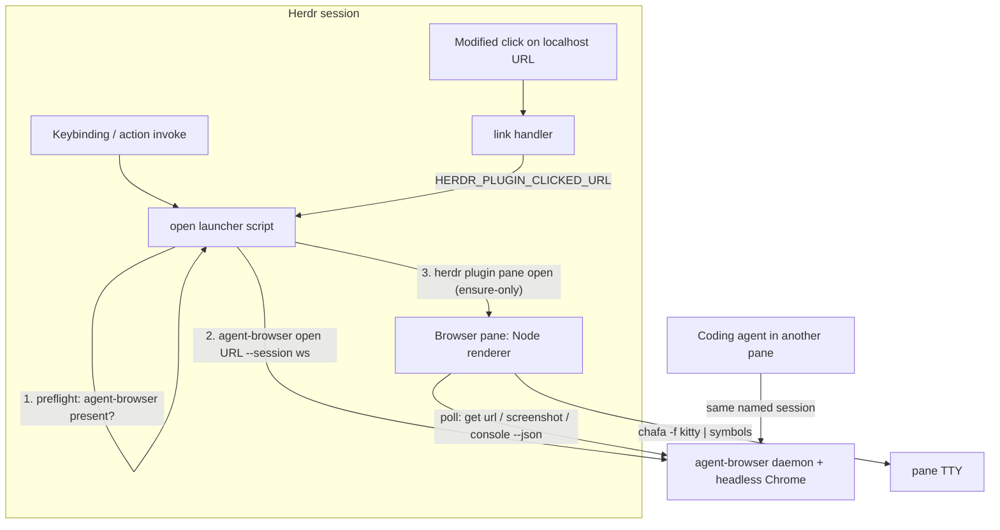
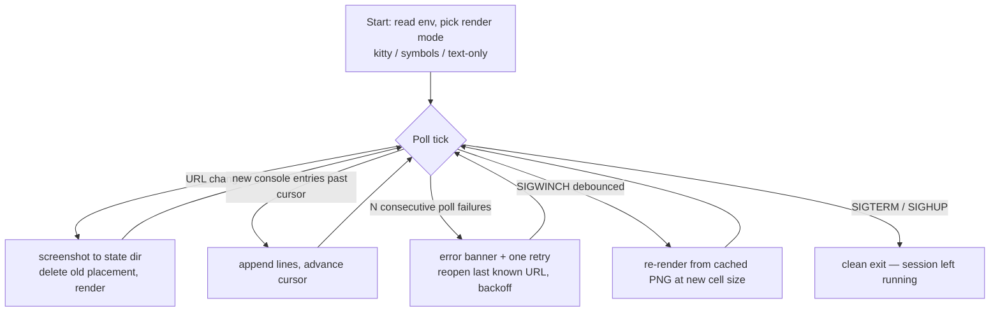

# feat: herdr-browser — driveable browser pane plugin for Herdr

**Target repo:** `StructuPath/herdr-browser` (greenfield; this document is its first artifact)

## Summary

Build `herdr-browser`, an open-source Herdr plugin that adds a driveable browser surface to the terminal: an action opens a URL in a headless Chrome session (via the `agent-browser` CLI), a split pane renders live screenshots and console output, and a link handler routes modified-clicks on localhost URLs into the pane instead of the system browser. Screenshots render as real pixels through Herdr's experimental Kitty graphics support, with ANSI half-block fallback as the default experience.

## Problem Frame

Herdr orchestrates coding agents in terminal panes, but verifying web UI work means leaving the terminal for Chrome. No plugin in the Herdr ecosystem provides a browser surface (Herdr's own philosophy is "no web view" — this lives as a community plugin, not an upstream change). The pieces already exist: Herdr's plugin v1 gives actions, panes, and link handlers; `agent-browser` gives a daemon-backed, session-named, JSON-speaking browser CLI; Herdr 0.7.x ships an experimental Kitty graphics renderer. Nobody has glued them together.

A second, load-bearing use case: a coding agent already driving `agent-browser` in one pane gets a *live human-visible view* of the same browser session in another — the pane is a passive viewer of the session the agent is working in.

---

## Requirements

**Core behavior**

- R1. Invoking the open action (via `herdr plugin action invoke` or a user keybinding) navigates a workspace-scoped `agent-browser` session to the given URL and ensures the browser pane is open.
- R2. The pane continuously shows the session's current page: screenshot, URL, and title, plus new console messages appended as they arrive (poll-based).
- R3. A modified-click on a `localhost`/`127.0.0.1` URL in any Herdr terminal pane opens it in the plugin pane instead of the default browser.
- R4. The pane is a non-destructive viewer of shared session state: console reads leave the buffer intact for other consumers (the coding agent), and closing the pane leaves the browser session running.

**Rendering**

- R5. Screenshots render as real pixels (Kitty graphics protocol) when Herdr's `experimental.kitty_graphics` is active, as ANSI half-blocks otherwise, and the pane degrades to text-only (URL/title/console) with an install hint when `chafa` is missing — the pane never exits on a missing renderer.

**Packaging**

- R6. Installable via `herdr plugin install StructuPath/herdr-browser`; local development via `herdr plugin link`; listed on the Herdr marketplace via the `herdr-plugin` GitHub topic.
- R7. Missing dependencies fail with actionable guidance at the right surface: `agent-browser` absence fails fast in the launcher before any pane opens; `chafa` absence degrades in-pane per R5.
- R8. README documents prerequisites, `kitty_graphics` enablement, keybinding configuration (plugins cannot ship default keybindings), and the session model.

---

## Key Technical Decisions

- **Engine: `agent-browser` CLI (Vercel Labs), not Playwright or a bespoke daemon.** It is the only candidate with a persistent daemon, named sessions, `--json` output, and console/network/screenshot reads as a shell CLI. Apache-2.0, native binaries, `npm i -g agent-browser` / `brew install agent-browser`. Pin behavior against v0.28.x and cite `agent-browser skills get core --full` as the canonical reference — it is a `-labs` project, expect flag churn.
- **Navigation happens in the launcher; the renderer is URL-stateless.** Pane env is spawn-time-only, so a second "open" can't reach a running renderer through env. Instead the launcher runs `agent-browser open <url> --session <s>` directly and `herdr plugin pane open` is ensure-only; the renderer polls `agent-browser get url --json` and re-screenshots on change. This eliminates any launcher→renderer IPC.
- **Session name is workspace-scoped, lifecycle is user/agent-owned.** Session derives from Herdr's workspace identity (`herdr-ws-<id>`, fallback `herdr-default`) so two workspaces don't fight over one Chrome page. The pane never closes the session — not on pane close, not on Herdr quit — because the coding agent may still be driving it. Cleanup is an explicit `close` action plus the documented `AGENT_BROWSER_IDLE_TIMEOUT_MS` idle shutdown. The pane never runs `agent-browser close --all`.
- **Console reads are non-destructive cursor reads.** `console --clear` would eat entries the coding agent's own `agent-browser console` expects. The renderer reads with `--json`, keeps a cursor (seen-count), and renders only new entries.
- **Rendering: `chafa` as the single image tool, explicit format selection.** `chafa -f kitty` when graphics are enabled, `-f symbols` otherwise — never chafa's auto-probe (unreliable inside Herdr's PTY). Kitty discipline: delete prior placement before each reprint (`ESC_Ga=d`), cache the last PNG in `HERDR_PLUGIN_STATE_DIR`, debounce SIGWINCH (~150ms) and re-render from cache so resize storms don't hammer Chrome.
- **Pane placement: `split`, never `popup`.** Popups are singleton, have no pane ID, and emit no lifecycle events — the plugin needs programmatic focus/close.
- **Implementation: bash launcher scripts + one zero-dependency Node renderer.** Launchers mirror the official `github-link-preview` example (thin `exec $HERDR_BIN_PATH ...` scripts). The renderer's poll loop, signal handling, and escape-sequence emission want a real language; Node ≥20 with zero npm deps means no `[[build]]` section and no install-time build failures.
- **Platforms: macOS + Linux only in v1.** Windows has documented plugin-spawn defects (relative pane commands unresolvable, `\\?\` verbatim paths, duplicate-action-ID rejection across platform gates — per the `herdr-file-viewer` project's verified caveats). Declare `platforms = ["macos", "linux"]` and defer Windows.

---

## High-Level Technical Design

Component topology and the open flow:

Renderer loop (directional guidance, not implementation specification):

---

## Implementation Units

### U1. Repo scaffold, manifest, and environment spike

- **Goal:** An installable/linkable plugin skeleton, plus empirical answers to the three facts the docs don't state.
- **Requirements:** R6
- **Dependencies:** none
- **Files:** `herdr-plugin.toml`, `README.md` (skeleton), `LICENSE` (MIT), `.gitignore`, `scripts/spike-env.sh` (temporary)
- **Approach:** Manifest with id `structupath.browser`, `min_herdr_version = "0.7.0"`, `platforms = ["macos", "linux"]`; declare actions (`open`, `close`), one pane (`view`, `placement = "split"`), one link handler — commands pointing at U2/U3 files. Register via `herdr plugin link`. Spike with a throwaway pane script that dumps env + `HERDR_PLUGIN_CONTEXT_JSON` to settle: (a) is `plugin pane open` idempotent on an existing pane; (b) do *actions* receive `HERDR_WORKSPACE_ID` and `HERDR_PLUGIN_STATE_DIR`; (c) does `chafa -f kitty` output actually render inside a Herdr pane with `experimental.kitty_graphics = true` under Ghostty. Record answers in the README's development notes and delete the spike script.
- **Patterns to follow:** `ogulcancelik/herdr-plugin-examples/github-link-preview` — manifest shape, action→pane flow; `smarzban/herdr-file-viewer` — production repo layout.
- **Test scenarios:**
  - `herdr plugin link <path>` accepts the manifest with no validation errors; `herdr plugin list` shows the plugin.
  - `herdr plugin action list --plugin structupath.browser` lists `open` and `close`.
  - Spike pane opens as a split and prints its env; closing the pane process closes the pane.
- **Verification:** Plugin links, actions listed, spike answers (a)–(c) recorded.

### U2. Launcher actions: open and close

- **Goal:** Thin bash launchers that own navigation, preflight, and pane ensure.
- **Requirements:** R1, R4, R7
- **Dependencies:** U1
- **Files:** `scripts/open.sh`, `scripts/close.sh`, `scripts/lib.sh` (shared: session-name derivation, preflight), `tests/open.bats` (or plain shell test harness — implementer's call)
- **Approach:** `open.sh`: preflight `command -v agent-browser` (fail fast with install hint on stderr before any pane opens); resolve URL from `$1` or `HERDR_PLUGIN_CLICKED_URL`; derive session name from workspace identity (per U1 spike; fallback `herdr-default`); `agent-browser open <url> --session <s>`; ensure pane via `herdr plugin pane open --plugin structupath.browser --entrypoint view --placement split --direction right --focus`, tolerating already-open (retry once on a conflict per the U1 idempotency answer). `close.sh`: `agent-browser close --session <s>` (never `--all`) then `herdr plugin pane close` if the pane is open.
- **Test scenarios:**
  - Open with a URL argument navigates the session and the pane appears; invoking open a second time with a new URL navigates the existing session without spawning a second pane.
  - Open with `agent-browser` absent from PATH exits non-zero with an install hint and does not open a pane.
  - Open with no URL and no `HERDR_PLUGIN_CLICKED_URL` exits non-zero with usage text.
  - Close ends the plugin's session (`agent-browser session list` no longer shows it) and leaves other named sessions untouched.
  - Two workspaces derive different session names (unit-test the derivation function with two workspace IDs).
- **Verification:** All scenarios pass against a linked plugin in a live Herdr session.

### U3. Pane renderer

- **Goal:** The zero-dependency Node renderer implementing the poll loop, rendering modes, and failure states from the HTD sketch.
- **Requirements:** R2, R4, R5, R7
- **Dependencies:** U1 (spike answers), U2 (session-name derivation must match)
- **Files:** `bin/renderer.mjs`, `tests/renderer.test.mjs` (node:test, mocking `agent-browser` via a stub script on PATH)
- **Approach:** Render-mode selection at startup: config/env override → else kitty when the U1 probe says Herdr renders it → else symbols; text-only when `chafa` missing. Status header (URL, title, session name, mode). Poll tick (~1s): `get url` change → screenshot into `HERDR_PLUGIN_STATE_DIR`, delete prior kitty placement, render via `chafa -f <mode> -s <cols>x<rows>`; console cursor read (non-destructive, `--json`), append new lines below the image. Error path: N consecutive failures → banner, one `agent-browser open <last-url>` retry with backoff, keep looping. SIGWINCH debounced ~150ms, re-render from cached PNG. SIGTERM/SIGHUP → clean exit, session left running.
- **Execution note:** Build against the stubbed `agent-browser` first; the stub's fixtures (url/console/screenshot JSON) become the test contract.
- **Test scenarios:**
  - URL change in fixtures triggers exactly one screenshot + render; unchanged URL triggers none.
  - Console fixture with 3 new entries past the cursor appends exactly those 3; a subsequent tick with no new entries appends nothing; buffer is never cleared (stub asserts `--clear` never passed).
  - Stub returning failures for N consecutive ticks produces the error banner and exactly one reopen retry per backoff window.
  - `chafa` absent → renderer stays alive in text-only mode with install hint; URL/title/console still update.
  - SIGWINCH burst (5 signals in 100ms) produces one re-render, from cache, with zero screenshot calls to the stub.
  - SIGTERM exits 0 without calling `agent-browser close`.
- **Verification:** Unit tests pass; manual check in a live pane shows image + streaming console against a real localhost app.

### U4. Link handler

- **Goal:** Modified-click on local dev URLs routes into the plugin.
- **Requirements:** R3
- **Dependencies:** U2
- **Files:** `herdr-plugin.toml` (link_handler section), `README.md` (behavior note)
- **Approach:** Rust-regex pattern matching `http(s)://localhost[:port]/...` and `127.0.0.1` equivalents (no lookaround available — keep the pattern simple), `action = "open"`; open.sh already consumes `HERDR_PLUGIN_CLICKED_URL`. Document that this fires on *modified* click only — plain clicks keep default behavior.
- **Test scenarios:**
  - Pattern unit checks (a table run through a Rust-regex-compatible tester): matches `http://localhost:3000`, `http://localhost:3000/path?q=1`, `https://127.0.0.1:8443`; does not match `https://example.com`, `http://localhost.evil.com`.
  - Live check: modified-click on a printed `http://localhost:3000` in an agent pane opens/focuses the browser pane at that URL.
- **Verification:** Live click routes to the pane; external URLs still open in the system browser.

### U5. README and dependency guidance

- **Goal:** A user can go from zero to working plugin without reading source.
- **Requirements:** R7, R8
- **Dependencies:** U2, U3, U4
- **Files:** `README.md`
- **Approach:** Sections: what it is (with a GIF/screenshot), install (`herdr plugin install StructuPath/herdr-browser`), prerequisites (`agent-browser` + `agent-browser install`, `chafa`), keybinding snippet (`[[keys.command]] type = "plugin_action"` — plugins cannot ship bindings), enabling `experimental.kitty_graphics` (framed as opt-in enhancement; ANSI fallback is the default experience), session model (workspace-scoped, agent-shareable, pane never kills it, idle-timeout tip), troubleshooting (text-only mode meaning, `herdr plugin log list`).
- **Test scenarios:** Test expectation: none — documentation unit; correctness is covered by U6's clean-machine walkthrough.
- **Verification:** A reader following only the README reaches a working pane.

### U6. End-to-end verification and publish

- **Goal:** Verified against a real app, then public and marketplace-listed.
- **Requirements:** R6
- **Dependencies:** U1–U5
- **Files:** no new files (repo settings + git)
- **Approach:** Full pass against a real localhost app (e.g., a running Next.js dev server): open action, second-URL navigation, link click, console streaming, kitty and fallback modes, close action. Uninstall/relink cycle to catch state-dir assumptions. Then create the public `StructuPath/herdr-browser` repo, push, add the `herdr-plugin` GitHub topic, and confirm `herdr plugin install StructuPath/herdr-browser` works from a clean state (marketplace listing appears within ~30 minutes, unreviewed).
- **Test scenarios:**
  - Fresh install on a machine/state without prior link: install → prereqs per README → open → working pane.
  - `herdr plugin uninstall` then reinstall leaves no orphaned browser session.
- **Verification:** Clean-state install works end-to-end; marketplace listing visible.

---

## Scope Boundaries

### Deferred to Follow-Up Work

- **DOM inspect and network-request actions** — `agent-browser snapshot` / `network requests` make these cheap follow-ups once the pane exists.
- **Live frame streaming** — `agent-browser stream enable` (WebSocket viewport frames) could replace screenshot polling for a true live view; payload schema is undocumented, so it stays out of v1.
- **Windows support** — blocked on documented Herdr Windows plugin-spawn defects.
- **On-demand screenshot action** (capture-to-file for sharing) — trivial via `agent-browser screenshot` directly; add if users ask.
- **Kitty unicode-placeholder rendering** (plan C if Herdr's graphics support turns out passthrough-shaped) — only relevant if the U1 spike falsifies the native-per-pane assumption.

### Non-goals

- No embedded webview or GUI — Herdr plugin v1 is explicit: no runtime action registration, no non-terminal UI.
- No interactive in-pane browsing (keyboard/mouse driving the page from the pane) — the pane is a viewer; driving happens through `agent-browser` commands or actions.
- No upstreaming into Herdr core.

---

## Risks & Dependencies

- **`experimental.kitty_graphics` is undocumented beyond one config line.** It may not render in a plugin pane at all, or only partially (clipping, scrollback interaction). Mitigation: it is an opt-in enhancement, never the default path; the U1 spike answers this before the renderer is built; ANSI fallback is fully supported.
- **`agent-browser` is a `-labs` project with flag churn.** Mitigation: document the tested version (0.28.x) in README, keep all CLI calls in `scripts/lib.sh` + one renderer module so surface changes are localized.
- **Herdr plugin API is v1 and evolving** (0.7.x). `min_herdr_version` pins the floor; the marketplace is unreviewed so breakage lands on us to fix.
- **Console buffer growth is unverified.** Non-destructive reads mean the plugin never trims the buffer; if `agent-browser` doesn't bound it, long sessions could grow it unboundedly. Verify during U3; if unbounded, document opt-in periodic clear (with the shared-consumer caveat).

---

## Open Questions

All three are execution-time facts settled by the U1 spike (none blocks planning):

1. Is `herdr plugin pane open` idempotent when the pane is already open? (Shapes U2's retry handling.)
2. Do action invocations receive `HERDR_WORKSPACE_ID` / `HERDR_PLUGIN_STATE_DIR`, or only panes? (Shapes U2's session-name derivation fallback.)
3. Is Herdr's Kitty graphics support native per-pane (binary strings suggest yes — `src/kitty_graphics.rs`, placement clipping, per-pane painting) or passthrough to the outer terminal? (Determines whether the deferred unicode-placeholder plan C ever becomes relevant.)

---

## Sources & Research

- Herdr plugin authoring: https://herdr.dev/docs/plugins/ — manifest schema, env contract, pane placements, link-handler regex dialect (Rust `regex` crate), install/marketplace flow.
- Reference plugins: `ogulcancelik/herdr-plugin-examples` (`github-link-preview` — the action→pane→link-handler pattern this plan copies), `smarzban/herdr-file-viewer` (repo layout, Windows caveats).
- `agent-browser`: https://github.com/vercel-labs/agent-browser — v0.28.0 verified locally; `agent-browser skills get core --full` is the version-matched command reference. Console/network confirmed poll-only; `--session` global; `--json` global.
- Kitty graphics: protocol spec (https://sw.kovidgoyal.net/kitty/graphics-protocol/) — delete-before-reprint (`ESC_Ga=d`), placement/scrollback semantics; chafa man page — `-f kitty|symbols`, `-s <cols>x<rows>`.
- Local environment (2026-07-18): herdr 0.7.4, agent-browser 0.28.0, node 24, Ghostty 1.3.1 (Kitty-graphics capable), no image renderer installed (`chafa` is a real user-facing prerequisite), `kitty_graphics` off in user config.
