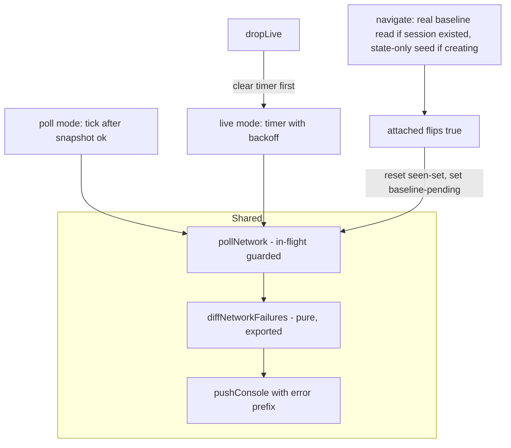

# feat: Surface failed network requests in the console region

## Summary

Closes issue #1: failed network requests (4xx/5xx and no-response failures) appear in the pane's console region with the `✖ ` error prefix, in both poll and live-stream modes. Implemented as a requestId-set diff over `agent-browser network requests --json` — agent-browser 0.33.2's push stream carries no network event, so polling is the only path.

## Problem Frame

The console region shows console API output and page errors but never failed network requests — a 404 or connection-refused fetch is visible in `agent-browser network requests` yet invisible in the pane. The data already exists in the shared daemon session; it just isn't painted. The pane's core audience (localhost dev debugging) hits this constantly.

---

## Requirements

**Display**

- R1. HTTP failures (status 400–599) on xhr/fetch/document requests appear in the console region as `✖ <status> <METHOD> <url>` within one poll interval.
- R2. Connection-level failures (entries whose status never arrives) appear as `✖ no response <METHOD> <url>` once the entry is older than the age threshold.
- R3. Failure lines appear in live-stream mode too, via a low-cadence dedicated poll, since the WebSocket stream has no network event type.

**Passivity and safety**

- R4. The pane issues no network call before `attached` is true, never passes `--clear`, and never causes session auto-creation — the existing passivity contract holds unchanged.
- R5. URLs are display-sanitized (`sanitizeText`) and hard-truncated before storage; failure lines flow through `pushConsole` so the 500-line cap, lazy region open, and repaint gating keep working.

**Noise control**

- R6. Attaching to a session with existing failures in the log produces no replay wall — the first read seeds a silent baseline. Re-attach after session death re-baselines.
- R7. Repeated identical failures (Chrome nav retries, app retry loops) are deduped, and per-poll output is capped with a `…and N more failed requests` summary line.

**Degradation**

- R8. A failing or unsupported `network` subcommand degrades only network reporting — screenshots and console keep painting, and older agent-browser versions without the command leave the pane fully functional.
- R9. A failed navigation the pane itself initiated still surfaces (the baseline must not swallow the user's own 404).

---

## Key Technical Decisions

- **Poll-diff, not stream.** Verified against the vercel-labs/agent-browser 0.33.2 source: the per-session WebSocket emits only `url`, `frame`, `console`, `page_error`, `tabs`. Issue approach 1 (consume a network stream event) is impossible today; a follow-up upstream feature request is deferred work.
- **Separate exec, not the snapshot batch.** The snapshot batch uses `--bail` and throws on a short result array — an agent-browser version lacking the `network` subcommand would brick every tick (no frames, no console) if the command joined the batch. A separate `network requests --type xhr,fetch,document --json` exec degrades independently, and live mode needs a standalone call anyway. `--type` also bounds payload (spike observed `data:` URLs with full base64 payloads in the log; `maxBuffer` is 16 MiB).
- **Optional duck-typed `network()` method on `makeBrowser`.** Every call site guards `typeof this.browser.network === "function"` — the `streamEnable` precedent (`bin/renderer.mjs` `goLive()`) — so the dozens of existing object-literal test fakes stay green.
- **Diff by requestId with prune-to-current-log, not count-based reconcile.** A live spike on 0.33.2 observed the request log wiped without `--clear` (browser relaunch after a failed navigation recreated the page target), so `reconcileConsole`-style count/tail matching is unsafe here. Seen-set membership = ids already reported OR resolved to a non-failure status (2xx/3xx); unreported null-status ids live only in a pending-candidates state and are reclassified every poll — report immediately when status lands at 400–599, drop at 200–399, report as "no response" past the age threshold. This closes the slow-failure hole where a request observed in-flight at poll N would swallow its 500 arriving at poll N+1. Both sets are pruned to ids present in the current log (bounds growth; `pid.N`-format requestIds can restart after relaunch, so pruning makes stale collisions harmless).
- **"Failed" = status 400–599, plus null-status entries older than 15 s.** Spike-verified: entries carry a ms-epoch `timestamp`, and null-status entries have no error field anywhere (the daemon drops `Network.loadingFailed` detail), so lines can only say "no response". Age-based detection beats poll-count heuristics because `pollDelay` backoff stretches ticks up to 30×. The `--type xhr,fetch,document` filter excludes EventSource/WebSocket, whose held-open connections would otherwise false-positive every localhost HMR/SSE stream.
- **Silent baseline on attach — a deliberate divergence from console behavior.** The console region replays full history on attach (`reconcileConsole` from `count: 0`); the network feed starts silent instead, because stale failures from an hours-old agent session are noise, not signal. Re-baseline everywhere `attached` flips. On the pane's own `navigate()` path (which sets `attached` directly), split by the existing `existed` check: if the session already exists, run a real baseline read before `open` (safe — no auto-creation); if it does not exist yet, seed state-only (empty seen-set, baseline marked consumed, **no CLI call** — a pre-`open` read would auto-create a session and break the ownership invariant). R9 holds on the fresh-session path because streaming daemons arm request tracking at spawn, so the navigation's own failure is in the log for the first post-attach poll.
- **One shared poll function for both modes, with an in-flight guard.** Poll mode calls it from `tick()` after a successful snapshot; live mode runs it on its own timer with `pollDelay`-style backoff. A single guard prevents the dropLive-transition race where a timer poll and a tick poll diff the same seen-set concurrently. The live timer is cleared as the first statement of `dropLive()` and each firing checks `this.live && this.attached` before executing (R4).
- **Zero new dependencies, Node 20 floor.** Repo policy — only `node:` builtins, `node --test` runner.

---

## High-Level Technical Design

Directional guidance, not implementation specification.

Line format: `✖ 404 GET https://api.example.com/users` / `✖ no response GET http://localhost:3000/api` — URL sanitized and truncated to ~200 chars before storage; per-poll overflow collapses into `✖ …and N more failed requests`.

---

## Implementation Units

### U1. Pure diff and formatting helpers

- **Goal:** The diff/classification/dedupe/format logic exists as exported pure functions, fully unit-testable without a Renderer.
- **Requirements:** R1, R2, R6, R7
- **Dependencies:** none
- **Files:** `bin/renderer.mjs` (helpers band), `tests/renderer.test.mjs`
- **Approach:** A `diffNetworkFailures(state, entries, nowMs, opts)`-shaped function taking the previous state (seen-set of reported-or-resolved-OK ids, pending null-status candidates, recent-failure memory) and the current entry list, returning new failure descriptors plus the next state (both id sets pruned to the current log). Classification per entry: status 400–599 → report unless already reported; status 200–399 → move to seen, never report; null status → pending, reported as "no response" only when `nowMs - timestamp > ageThreshold` (default 15 000 ms), and reclassified on every poll so a late-arriving status wins. Dedupe by `method + url + (status ?? "no response")`: within the returned batch, and across polls via a 60 s suppression window refreshed on each suppressed hit (a steady retry loop paints once, not every poll). Cap output at N (~5) per poll with an overflow count. A small formatter builds the display line (sanitize + truncate URL ~200 chars).
- **Patterns to follow:** `reconcileConsole` / `pollDelay` — exported pure helpers in the labeled helpers band; tabs, double quotes, why-not-what comments naming the failure mode.
- **Test scenarios:**
  - New 404 entry → one `✖ 404 GET <url>` descriptor; same entry next poll → nothing (seen).
  - Entry with null status and age 5 s → nothing; same entry at 20 s → `no response` descriptor; entry that gains status 200 before threshold → never reported.
  - Entry with null status at poll 1, status 500 at poll 2 → exactly one `✖ 500` descriptor, at poll 2 (late-arriving failure status is not swallowed by the seen-set).
  - Same failing `method + url + status` key on 5 consecutive polls → one line total (60 s cross-poll suppression window).
  - Log wipe (current entries no longer contain seen ids) → seen-set pruned, no replay of surviving-but-already-seen ids re-added later with same id.
  - Chrome nav retry shape: 3 entries, distinct requestIds, same URL + null status → one line, not three.
  - 12 distinct failures in one poll with cap 5 → 5 lines + `…and 7 more failed requests`.
  - Baseline call (`state` empty, `baseline: true` or equivalent) → zero descriptors, seen-set populated with all current ids.
  - URL with ANSI escape bytes and 5 000 chars → sanitized, truncated to ~200 chars.
- **Verification:** `npm test` green; every scenario above has a direct assertion on the returned descriptors/state.

### U2. `network()` method on the browser wrapper

- **Goal:** `makeBrowser` exposes an optional `network()` returning the parsed request list, with the CLI contract pinned by stub tests.
- **Requirements:** R4, R8
- **Dependencies:** none
- **Files:** `bin/renderer.mjs` (agent-browser access band), `tests/renderer.test.mjs`
- **Approach:** `network: async () => run("network", "requests", "--type", "xhr,fetch,document")`, normalizing the result to an array. No `--clear`, ever.
- **Patterns to follow:** the `streamEnable`/`run` wrappers; bash-stub CLI-contract tests in the existing batch-shape test style.
- **Test scenarios:**
  - Stub returns `{requests: [...]}` → method resolves to the array; malformed JSON → rejects (caller degrades).
  - Stub logs argv → assert exact args include `--type xhr,fetch,document` and `--json`, and assert `--clear` never appears (extend the existing never-destructive contract test).
- **Verification:** `npm test` green; argv assertions pass against the stub.

### U3. Poll-mode integration in `tick()`

- **Goal:** Poll mode paints failure lines; a broken network poll never affects frame/console painting.
- **Requirements:** R1, R2, R4, R5, R6, R8, R9
- **Dependencies:** U1, U2
- **Files:** `bin/renderer.mjs` (Renderer: constructor state, `tick()`, attach transition, `navigate()`), `tests/renderer.test.mjs`
- **Approach:** New constructor state (`networkState`, baseline-pending flag) following the `<noun><Qualifier>` naming convention. In `tick()`, after the snapshot succeeds, run the shared poll: duck-type guard, own try/catch that swallows into a counter (no banner — the feature is best-effort), baseline consumed on first read after any `attached` flip. On a maxBuffer/timeout-class failure from `network()`, stop polling for the rest of the attach and push a one-time `✖ network reporting off — request log too large` line — the daemon log is unbounded (verified: append-only Vec, `--clear` is the only eviction), so retrying a known-fatal multi-MiB exec every tick is pure waste. Push descriptors via `pushConsole([{text, type: "error"}], false)` so `consolePushes`/`sig()` backoff-reset work unchanged; use the tick's existing console layout dance for the first-line region open. In `navigate()`, split baseline seeding by the `existed` check per the KTD: real read before `open` when the session existed, state-only seed (no CLI call) when the pane is creating it.
- **Patterns to follow:** `tick()`'s swallow-and-degrade error idiom (counter, no unguarded paths); `suppressConsoleOnce` one-shot consumption shape (but a separate flag — do not reuse the console's).
- **Test scenarios:**
  - Fake browser with `network` returning a 404 entry → after two ticks (baseline, then report… first tick baselines silently, entry present at baseline is NOT reported; a new failing id on tick 2 → `✖ 404` line appears in `consoleLines`).
  - Fake browser without a `network` method (existing object-literal fakes) → all current tick tests pass unmodified.
  - `network()` rejecting every tick → screenshots/console still paint, no banner, no uncaught rejection.
  - Session death → `attached` false → recreation → re-attach → failures from before re-attach not replayed; new ones are.
  - `network()` rejecting with a maxBuffer/timeout-class error → polling stops for the rest of the attach, exactly one `request log too large` line; a fresh re-attach resumes polling.
  - `navigate()` to a refused port on the self-created path → no `network` call before `open` (call-log assertion), and the navigation's own failure line appears on the first post-attach poll.
  - `navigate()` into an already-existing session → baseline read fires before `open`; prior failures not replayed, the navigation's own failure reports.
  - Update `"tick stays passive when the session is missing"` — call sequence stays `["sessionExists"]` (no network call while unattached).
  - Network lines in `consoleLines` do not perturb console reconcile: console entries still diff correctly afterward (guards the `consoleState`-vs-display separation).
- **Verification:** `npm test` green including the two deliberately-updated passivity tests; manual check with a linked pane (close/reopen the pane after edits — a running pane keeps the old renderer).

### U4. Live-mode timer

- **Goal:** Failure lines appear while the WebSocket stream is active, without violating passivity or the unwatched-pane-costs-nothing principle.
- **Requirements:** R3, R4, R7
- **Dependencies:** U3
- **Files:** `bin/renderer.mjs` (`goLive()`, `dropLive()`, live branch of `tick()` or a dedicated timer), `tests/renderer.test.mjs`
- **Approach:** Start a timer on successful `goLive()` (base ~4 s) that fires the shared poll with `pollDelay`-style backoff, reset by frame/console stream activity or by a poll that returned failure descriptors (a silently failing background fetch on a static page produces neither frames nor console entries — the failures themselves must hold the cadence). Guards: clear the timer as the first statement of `dropLive()`; each firing checks `this.live && this.attached`; shared in-flight guard prevents a timer poll and a tick poll racing across the dropLive transition. Paint via `queueConsolePaint(hadConsole)` (handles the console-region-opens layout change in live mode).
- **Patterns to follow:** `streamCooldownUntil`/`lastLiveCheck` cadence state; stream handlers' `queueConsolePaint` usage.
- **Test scenarios:**
  - Live mode faked (`r.live = {ws: ...}`) with a failing entry appearing in `network()` → line lands in `consoleLines` after the timer fires (drive the timer hook directly rather than real time).
  - `dropLive()` → timer cleared; an in-flight poll resolving after the drop pushes nothing twice (in-flight guard) and the post-drop tick does not re-report entries the timer already showed.
  - Update `"live tick only watches liveness"` deliberately for the new call pattern.
  - Timer firing after session death (`sessionExists` false path) → no session-creating call.
- **Test expectation note:** backoff-cadence exactness is not asserted (timing-flaky); assert the reset-on-activity state transitions instead.
- **Verification:** `npm test` green; a live-mode manual session shows failure lines within a few seconds.

### U5. README documentation

- **Goal:** The console-region docs describe failure lines and their limits.
- **Requirements:** R1, R2, R3
- **Dependencies:** U3, U4
- **Files:** `README.md`
- **Approach:** Extend the console-region description (Highlights + relevant Troubleshooting notes): what shows (`✖ 404 GET …`, `✖ no response …`), the xhr/fetch/document scope, the ~15 s delay on no-response detection, that history before pane attach is intentionally not replayed, and that failure reporting turns itself off on very long sessions once the daemon's unbounded request log outgrows the read buffer.
- **Test scenarios:** Test expectation: none — documentation only.
- **Verification:** README reads accurately against shipped behavior.

---

## Scope Boundaries

**In scope:** failure display in the console region, both modes, tests, README.

**Not in scope:**

- Successful-request display, request detail drill-down, HAR anything.
- Merging failure lines chronologically with console entries — polling makes interleaving inherently approximate; accepted.
- The pane calling `network requests --clear` to bound daemon log growth — the pane is passive and external agents may depend on the log.

**Deferred to follow-up work:**

- Upstream feature request to vercel-labs/agent-browser for a `network` stream event (read their CONTRIBUTING and templates first), which would replace the live-mode timer entirely.
- Upstream issue for `tracked_requests` growth: verified unbounded in 0.33.2 (append-only Vec, `--clear` is the only eviction, armed at daemon spawn on streaming daemons) — request a cap or eviction policy.

---

## Risks & Dependencies

- **agent-browser flag churn.** A `-labs` project; every CLI fact here was verified against 0.33.2 (installed) via the upstream source and a live spike. The separate-exec + duck-type design means a future breaking change degrades network reporting only. Re-verify `network requests` argv against the installed version at implementation time.
- **Arming semantics (verified in 0.33.2 source).** Daemons started with a stream server arm request tracking at startup (`new_with_stream` sets `request_tracking = true`); non-stream daemons lazy-arm on the first `network requests` call. herdr sessions run streaming daemons, which is why the spike saw pre-existing requests tracked. Both paths are handled by the unconditional baseline read.
- **Unbounded daemon request log.** On a long-lived, request-heavy session the `network requests` payload grows monotonically toward the 16 MiB `maxBuffer` / 10 s exec timeout; when either trips, the pane disables network reporting for the rest of the attach with a one-time console note (U3). The real fix is upstream (deferred follow-up).
- **Long-poll XHR false positives.** An XHR held open past 15 s with no response reports as failed. The type filter removes the worst offenders (SSE/WS); dedupe and the per-poll cap bound the residual noise. Revisit the threshold if real-world use complains.
- **Console-line eviction.** A burst of failures (dead API server) can evict genuine console lines from the 500-line ring; the per-poll cap is the mitigation, accepted as sufficient.
