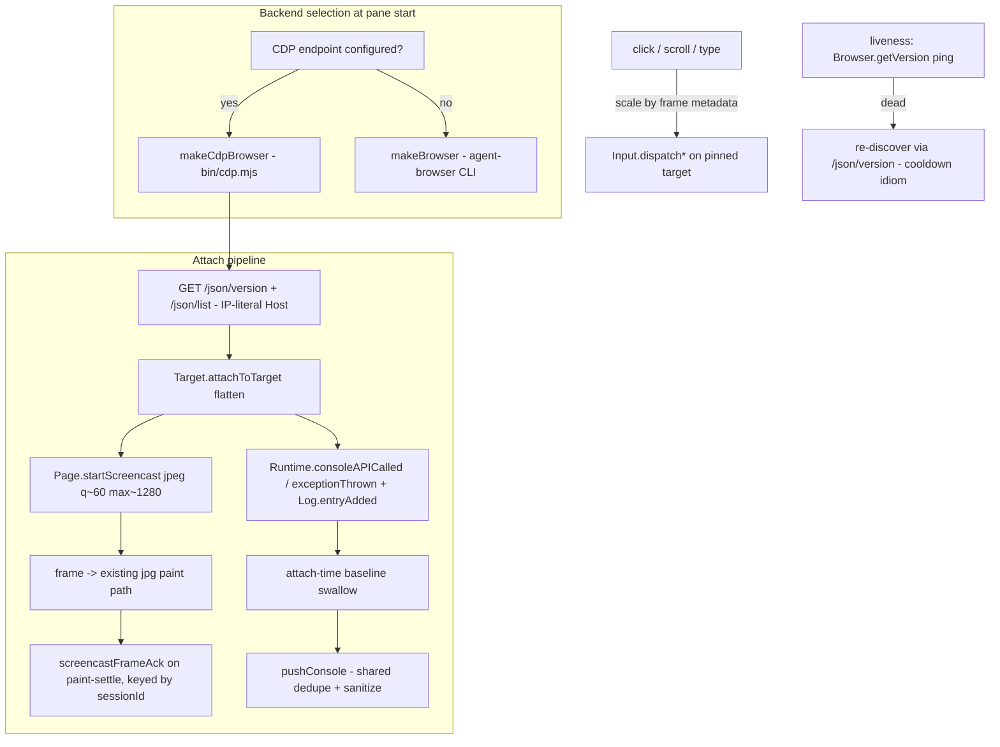

# feat: CDP attach mode — observe any DevTools-protocol browser

## Summary

The pane gains a second backend: attach to any Chrome DevTools Protocol endpoint — a Playwright-, Puppeteer-, or Browser Use-launched Chrome, or any browser started with `--remote-debugging-port`. Frames arrive by ack-paced JPEG screencast, the console region is fed natively from CDP events (including "Failed to load resource" lines with real error text), and the user can click, type, and scroll in the observed browser. agent-browser mode stays the default and untouched. Attach mode never creates, closes, or emulates anything, and the plugin still exposes no listening port.

## Problem Frame

The pane only observes agent-browser sessions, while most agent browser automation runs on Playwright/Puppeteer/CDP stacks. The competing `ogulcancelik/herdr-browser` plugin won attention by accepting any CDP client — but it does so by owning its own Chromium behind an unauthenticated loopback control gateway, with pixels-only observability. Attaching read-mostly to the automation stack the user already runs takes the universality without the control surface, and CDP's `Log`/`Runtime` domains carry failure detail (real `net::ERR_*` error text) that agent-browser's daemon structurally drops.

---

## Requirements

**Attach and render**

- R1. Given a CDP endpoint (`ws://` URL or `http://host:port`), the pane discovers the browser target via `/json/version`, attaches a flat session to a page target, and renders live JPEG screencast frames through the existing frame path.
- R2. Screencast frames are acknowledged only after the paint enqueue settles, bounding Chrome's encode rate to the pane's paint throughput; a skipped or misdirected ack never freezes the pane (acks are unconditional per received frame). Note the paint path acks immediately while stdout is blocked or chafa is cooling down — freeze-prevention wins over backpressure there; frame cost is bounded by JPEG quality, max dimensions, and `everyNthFrame`, not by ack starvation.
- R3. On endpoint death or WebSocket drop, the pane re-discovers via `/json/version` (never re-dials a cached token URL) using the existing cooldown/waiting-banner idioms; a raw-`ws://`-only endpoint that drops shows a terminal banner instead of a retry loop. Reattach compares the browser's identity (`/json/version` GUID and product string) against the previous attach — a different browser on the same port resets console/frame state and pushes a "reattached to a different browser" discontinuity marker.
- R4. In kitty mode without chafa, attach mode degrades to `Page.captureScreenshot` PNG polling riding the existing `pollDelay` backoff.

**Input**

- R5. Click, scroll, and type map to `Input.dispatchMouseEvent` / `dispatchKeyEvent` / `insertText` on the attached target, with click coordinates scaled per frame from screencast metadata (`deviceWidth`/`deviceHeight` vs frame pixel size) — never from cached dimensions.
- R6. The pane pins one page target; a cycle key moves between page targets, and re-selection happens automatically only when the pinned target is destroyed — never on target creation.

**Observability**

- R7. The console region is fed by `Runtime.consoleAPICalled` and `Runtime.exceptionThrown` (console + errors) and `Log.entryAdded` (network failures with error text, violations); the CDP `Network` domain is not enabled, eliminating duplicate failure lines by construction. Events from out-of-process iframes and workers are captured by an events-only `Target.setAutoAttach` (`waitForDebuggerOnStart: false`, flattened) on the pinned page session — rendering and input stay pinned to the page target.
- R8. Log-source network failures render with the same `✖ ` prefix and pass through the same recent-window dedupe map as the polling feed, so a retry loop paints once in either mode. Log entries carry text + URL, not structured method/status — lines show Chrome's error text; no fake method/status parity is synthesized.
- R9. Attach never replays history: buffered `Log` entries AND replayed `Runtime.consoleAPICalled`/`exceptionThrown` events (Chrome flushes the console backlog on `Runtime.enable`) older than the attach timestamp are swallowed, mirroring the network-feed silent baseline.
- R9a. A `console: log-only` config tier skips `Runtime.enable` entirely — `Runtime.enable` has page-observable side effects (execution-context reporting, eager argument serialization) that stealth automation stacks avoid; observing such a run must be possible without perturbing it. Default tier is `runtime+log`.

**Mode arbitration and passivity**

- R10. Backend selection: an explicitly configured CDP endpoint wins over an agent-browser session, with a banner naming the other backend; the choice is deterministic at pane start.
- R11. Attach mode never calls `Target.createTarget`, `Target.closeTarget`, or `Emulation.setDeviceMetricsOverride`; `selfCreated` is hard-false; cleanup is `Page.stopScreencast` plus WebSocket close only. The automation client owns viewport and lifecycle.
- R12. Switching backends resets all reconciliation state (console cursors, network state, frame hash) and pushes one discontinuity marker line.
- R13. Cmd+click localhost links, which are agent-browser-specific today, either route to the attached target or refuse with a clear message — they never spawn an invisible agent-browser session while the pane is attached elsewhere.

**Degradation and security**

- R14. On Node < 22 (no global `WebSocket`), attach mode is unavailable with a banner saying exactly that; agent-browser mode keeps working on Node 20.
- R15. DevTools WebSocket URLs are capability tokens: only host:port is ever displayed or logged; the token path never reaches the header, banners, debug logs, or state files.
- R16. A non-loopback endpoint triggers a one-time warning banner (plaintext transport, full browser capability).
- R17. A frame-staleness watchdog detects a screencast that has stopped producing frames (hidden tab, DevTools contention), banners "frame stale (tab hidden or contended)", attempts exactly one screencast restart, and keeps the last frame on screen.

---

## Key Technical Decisions

- **Second duck-typed backend, not a mode flag threaded through the Renderer.** `makeCdpBrowser()` presents the same surface the Renderer already duck-types (`open`, `click`, `scroll`, `type`, `sessionExists`, …) and deliberately **omits** `setViewport` and `network` — the existing `typeof` guards then disable viewport fitting and the polling failure feed by construction. These omissions are the no-emulation and no-double-reporting contracts and get their own tests. (Verified: `fitViewport` and `pollNetwork` already guard on method presence.)
- **Zero-dep CDP client on native WebSocket, in a new `bin/cdp.mjs`.** Spike-verified on Chrome 150 / Node 24: `/json/version` discovery, `Target.attachToTarget {flatten:true}`, request/response correlation with `sessionId` routing. Node 22 floor for attach mode only (R14); no `ws` package. Injectable WebSocket factory for tests, mirroring the repo's stub-based test style. Discovery uses `node:http.request`, NOT global fetch — WHATWG fetch silently drops a custom Host header (verified on Node 24), and Chrome 111+ rejects DNS-name Hosts on `/json/*`, so the client sends an IP-literal Host explicitly.
- **Ack-paced screencast, acked on paint-settle.** The spike confirmed frames halt until `Page.screencastFrameAck` — pacing before encode, the one idea worth taking from the competitor. Their fixed 750 ms boost and PNG-only pipeline are not taken: JPEG with a quality knob (default ~60) and pane-scaled `maxWidth/maxHeight` (~1280 cap) bound decode cost and message size. Every received frame is acked once its paint enqueue settles (a skipped or stdout-blocked paint still acks — freeze-prevention wins; see R2's honest bound). **Two distinct identifiers:** the ack echoes the frame event's **integer** `sessionId` in its params while routing over the flat-session **string** `sessionId` — conflating them means Chrome ignores acks and the stream freezes after the in-flight quota. Pacer state (including the last integer id) resets on every (re)attach and screencast restart.
- **Pinned-target policy.** Pin the first `type === "page"` target; a cycle key walks page targets; auto-re-pin only on `Target.targetDestroyed` of the pinned target. Never follow `targetCreated` for rendering — following an automation client's ephemeral targets thrashes the pane. Event subscription is broader than rendering: an events-only `Target.setAutoAttach` on the page session picks up OOPIF/worker console and Log events (R7) without moving the picture. Hidden-tab throttling and DevTools screencast contention both look like a frozen frame: the R17 watchdog covers both.
- **Console feed partition: Runtime + Log domains, Network domain off.** `Log.entryAdded` carries network failures with `net::ERR_*` text (spike-verified) — error detail agent-browser's daemon drops entirely. Skipping the Network domain eliminates the Log/Network duplicate-line class instead of deduping it. Accepted tradeoff: Log emits nothing for a request that hangs without failing, so the polling feed's 15 s "no response" heuristic has no attach-mode equivalent — a documented blind spot, not a regression to hide (U6). Log network entries keep the `✖ ` prefix and flow through the same recent-window dedupe map as the polling feed (extracted from `networkState.recent` — a small refactor U4 owns), so both modes have identical noise behavior (R8). The `log-only` tier (R9a) exists because `Runtime.enable` is page-observable and can trip bot detection on stealth runs — the plan's passivity story is honest about that footprint.
- **Explicit endpoints only.** `HERDR_BROWSER_CDP_URL` env, a `cdp-url` config-dir file, and a dedicated attach prompt key — the `u` prompt stays purely navigation (bare `localhost:9222` already means "navigate there" and must not become ambiguous). No port scanning: attaching uninvited is off-brand and indistinguishable from probing.
- **CDP-wins arbitration with a banner.** Setting an endpoint is the more deliberate act than an ambient agent-browser session existing; deterministic beats clever (R10).
- **The competitor's mistakes, deliberately not repeated:** no listening port of any kind (their gateway is unauthenticated loopback); no `Emulation.setDeviceMetricsOverride` (their viewer fights its own automation clients over viewport); no fixed kitty image id collisions (our existing frame path already handles ids); reconnect is re-discovery, not a one-way degradation latch.

---

## High-Level Technical Design

Renderer changes stay thin: the attach pipeline presents itself to the Renderer as a live stream (frames and console events pushed, poll loop reduced to liveness), reusing `onStreamMessage`-shaped entry points, `pushConsole`, `queueConsolePaint`, and the cooldown/banner idioms. The heavy lift is `bin/cdp.mjs` plus a backend-shaped adapter, not Renderer surgery.

---

## Implementation Units

### U1. Zero-dep CDP client (`bin/cdp.mjs`)

- **Goal:** A tested, dependency-free CDP session layer: HTTP discovery, flat-session attach, message correlation, event dispatch, liveness ping, clean close.
- **Requirements:** R1, R3, R14, R15
- **Dependencies:** none
- **Files:** `bin/cdp.mjs`, `tests/cdp.test.mjs`
- **Approach:** Exported `discoverEndpoint(input)` (normalizes `http://host:port` vs `ws://…`, requests `/json/version` + `/json/list` over `node:http` with an explicit IP-literal Host header — global fetch cannot set Host; a pasted page-level `/devtools/page/<id>` URL is detected and rejected with a message naming the browser-level endpoint) and `makeCdpSession(wsUrl, {wsFactory})` returning `{send(method, params, sessionId), on(event, fn), ping(), close()}`. `wsFactory` injection is the test seam — no network in unit tests. A `redactWsUrl(url)` helper returns host:port only (R15). Node-version gate: export `cdpSupported()` checking `typeof WebSocket === "function"`.
- **Patterns to follow:** `makeBrowser`'s closure-over-config shape; stub-injection tests like the existing bash-stub CLI tests; swallow-and-degrade error idiom.
- **Test scenarios:**
  - `discoverEndpoint("http://127.0.0.1:9222")` against a stub HTTP server → browser ws URL and page target list; DNS-name input → stub asserts the received Host header is an IP literal.
  - Page-level `ws://…/devtools/page/<id>` input → rejected with a message pointing at the browser endpoint.
  - Request/response correlation: two in-flight `send`s resolve to their own results; error responses reject.
  - Events with `sessionId` route to the right subscriber; unknown ids are dropped without throwing.
  - `ping()` timeout → session reports dead; `close()` is idempotent.
  - `redactWsUrl` strips the token path from every URL shape; `cdpSupported()` false path.
- **Verification:** `npm test` green; no new dependencies in `package.json`.

### U2. `makeCdpBrowser` backend adapter

- **Goal:** The Renderer-facing backend surface over a CDP session, with the passivity contract encoded as deliberate interface omissions.
- **Requirements:** R5, R6, R11
- **Dependencies:** U1
- **Files:** `bin/cdp.mjs` (same file as U1's session layer), `tests/cdp.test.mjs`
- **Approach:** `makeCdpBrowser(endpoint)` exposing the full surface the Renderer's key handlers call unguarded: `open(url)` → `Page.navigate`, `back()`/`forward()` → `Page.getNavigationHistory` + `navigateToHistoryEntry`, `reload()` → `Page.reload`, `click(x, y)` / `scroll(dir, px)` / `type(text)` → Input domain (coordinates pre-scaled by the caller per R5), `sessionExists()` → ws liveness + pinned-target existence, `screenshot(path)` → `Page.captureScreenshot` (the kitty-without-chafa poll source, R4), `cycleTarget()`, plus `onMessage(handler)` — the event bridge: the adapter translates CDP events into the existing stream-message shapes (`{type:"frame"}`, `{type:"console"}`, `{type:"page_error"}`, `{type:"url"}` from `Target.targetInfoChanged`, which is also the header's url/title source in attach mode) so the Renderer wires it straight into its `onStreamMessage` path. Deliberately **no `setViewport`, no `network`, no `snapshot`, no `streamEnable`/`streamStatus`** — with a test asserting those keys are absent (the duck-type guards then disable viewport fitting, the polling feed, and the goLive path by construction). Target pinning per the KTD: first `page` target, re-pin on `targetDestroyed` only.
- **Patterns to follow:** duck-typed optional methods (`streamEnable` precedent); `selfCreated` never set by this backend.
- **Test scenarios:**
  - Adapter surface: `setViewport` and `network` are `undefined` (the no-emulation / no-double-report contracts).
  - `open` navigates the pinned target, never creates one (fake session asserts no `Target.createTarget` ever sent — the R11 passivity test).
  - Pinned target destroyed → re-pins to a surviving page target; created targets are ignored.
  - `type("héllo")` routes through `insertText`; Enter/arrow keys through `dispatchKeyEvent` pairs.
  - `back()`/`forward()`/`reload()` issue the right Page-domain calls (the `b`/`f`/`r` keys call these unguarded — absence would banner a misleading agent-browser error).
  - `onMessage` delivers a screencast frame as a `{type:"frame"}`-shaped message and `targetInfoChanged` as `{type:"url"}`.
- **Verification:** `npm test` green; grep confirms no `createTarget`/`closeTarget`/`setDeviceMetricsOverride` strings in the adapter.

### U3. Attach pipeline in the Renderer

- **Goal:** Frames paint, input works, reconnect behaves — attach mode is a first-class live backend.
- **Requirements:** R1, R2, R3, R4, R5, R10, R12
- **Dependencies:** U2
- **Files:** `bin/renderer.mjs`, `tests/renderer.test.mjs`
- **Approach:** Mode arbitration in the constructor/start path (CDP endpoint present → attach backend + banner naming the skipped agent-browser session). Screencast frames enter the existing `onStreamMessage`-shaped jpg path via the adapter's `onMessage` bridge; the ack echoes each frame's **integer** `sessionId` over the flat-session string route, fires when the paint enqueue settles, unconditionally per frame, and pacer state (including the last integer id) resets on every (re)attach and screencast restart (R2). Click coordinates scale by the latest frame's `metadata.deviceWidth / frameWidth` — held per frame, never cached (R5). Liveness ping replaces the 15 s `sessionExists` check; drop → re-discovery via cooldown idiom with the R3 browser-identity comparison, raw-`ws://` endpoints get a terminal banner. Kitty-without-chafa → `screenshot()` polling on `pollDelay` (R4). Backend switch resets `consoleState`/`networkState`/`lastHash`/`shotFormat` and pushes a discontinuity line (R12). **Backend-aware ownership paths:** `navigate()` skips the `selfCreated` assignment and `cleanup()` skips the `agent-browser close` branch whenever the active backend is CDP — attach-mode cleanup is `Page.stopScreencast` + ws close only (R11); the `userAction` failure banner becomes backend-supplied text. Frame-staleness watchdog per R17.
- **Patterns to follow:** `goLive`/`dropLive` transition hygiene; `streamCooldownUntil` cadence state; `userAction` banner parametrized per backend (the "agent-browser not responding" string becomes backend-supplied).
- **Test scenarios:**
  - Fake CDP backend pushes a jpeg frame → painted via the jpg path; ack sent exactly once after paint settles; a frame arriving during a blocked paint still acks.
  - Reconnect mints a new session → old pacer state discarded; a screencast restart mints a new integer ack id and the old integer id is never acked.
  - Attach-mode quit → no agent-browser subprocess spawned (call-log assertion on cleanup), even after a navigate that found `sessionExists()` false.
  - Reattach to the same port with a different browser GUID → state reset + "reattached to a different browser" marker.
  - Retina-scaled frame (deviceWidth 2× frame width) → click at pane center dispatches at scaled page coordinates.
  - Endpoint dies (ping timeout) → waiting banner + re-discovery attempt; raw `ws://` endpoint → terminal banner, no retry.
  - Both backends configured → attach wins, banner names the agent-browser session.
  - Backend switch → console/network state reset, one discontinuity marker, no replayed lines.
  - Existing agent-browser mode tests pass unmodified (the default path is untouched).
- **Verification:** `npm test` green; manual attach to a locally launched `--remote-debugging-port` Chrome shows live frames and working clicks.

### U4. Event-driven console and failure feed

- **Goal:** Attach mode's console region is richer than agent-browser mode's, with identical noise behavior.
- **Requirements:** R7, R8, R9
- **Dependencies:** U3
- **Files:** `bin/renderer.mjs`, `bin/cdp.mjs`, `tests/renderer.test.mjs`
- **Approach:** Enable `Log` always; `Runtime` per the R9a tier (default on, `log-only` skips it). Events-only `Target.setAutoAttach` on the page session brings OOPIF/worker events in (R7). `consoleAPICalled` → existing console line shape (shallow arg text extraction, hard-capped, no `Runtime.getProperties` — size and passivity); `exceptionThrown` → `✖` line. `Log.entryAdded` with `source: "network"` → `✖` line with Chrome's error text + URL, through the shared recent-window dedupe map (extract the `recent` map from `networkState` so both feeds share it); other Log sources (violation, security) → prefixed lines. Attach-time baseline: swallow Log AND replayed Runtime events whose timestamp predates the attach (R9).
- **Patterns to follow:** `pushConsole`/`queueConsolePaint` for everything; `sanitizeText` + truncation at push time; the network-feed baseline idiom.
- **Test scenarios:**
  - `consoleAPICalled` warn/log/error → prefixed lines; a 100-arg call → one capped line.
  - `Log.entryAdded` network error → one `✖` line in the same shape as the polling feed's output for the same failure.
  - The same failing fetch retried 5× (five Log entries, same URL/text) → one line (shared dedupe).
  - Buffered Log entries with pre-attach timestamps → swallowed; post-attach → painted.
  - Replayed `consoleAPICalled` backlog with pre-attach timestamps → swallowed (the `Runtime.enable` flush case); post-attach → painted.
  - `log-only` tier → no `Runtime.enable` sent (call-log assertion), Log lines still paint.
  - OOPIF-session Log entry (via auto-attached session) → painted like a page-session entry.
  - `exceptionThrown` → `✖` line with sanitized text.
- **Verification:** `npm test` green; manual attach shows `net::ERR_CONNECTION_REFUSED` text for a refused fetch — detail agent-browser mode structurally cannot show.

### U5. Entry affordances, link handler, and security hygiene

- **Goal:** Deterministic, safe ways in and out of attach mode.
- **Requirements:** R10, R13, R14, R15, R16
- **Dependencies:** U3
- **Files:** `bin/renderer.mjs`, `scripts/open.sh`, `tests/renderer.test.mjs`, `tests/launchers.test.mjs`
- **Approach:** Endpoint sources in precedence order: `HERDR_BROWSER_CDP_URL` env > `cdp-url` config-dir file (documented). Dedicated attach prompt key (`a`) accepting `ws://…` or `http://host:port` — the `u` prompt's validation is untouched. Node < 22 with an endpoint configured → explanatory banner (R14). All display/log paths route endpoint URLs through `redactWsUrl` (R15); non-loopback host → one-time warning banner (R16). **Link handler (R13): `open.sh` decides attach mode from the same static sources the renderer uses** — the `cdp-url` config-dir file first (safe regardless of whether herdr propagates user env to actions) and `HERDR_BROWSER_CDP_URL` when present — falling back to the renderer's mode marker only for prompt-entered endpoints. A marker can't exist before the first renderer start, so static sources are the primary authority; this closes the cold-start race where the first Cmd+click would spawn exactly the invisible agent-browser session R13 forbids. In attach mode the URL lands in a state-dir handoff file the renderer picks up via `fs.watch` (tick-time read as fallback — `pollDelay` backoff would otherwise delay pickup up to 30 s).
- **Patterns to follow:** `configValue()` for config-dir reads; prompt state machine from the `u` prompt; state-dir file conventions (0600, workspace-scoped names).
- **Test scenarios:**
  - Precedence: env beats config file; neither → agent-browser mode untouched.
  - `a`-prompt: valid `http://127.0.0.1:9222` accepted; `https://example.com` refused with a banner (it's a navigation URL, not an endpoint).
  - Header/banner text for an attached endpoint contains host:port and never the token path (assert on rendered strings).
  - Non-loopback endpoint → exactly one warning banner.
  - `open.sh` with attach-mode marker present → no `agent-browser` invocation (launcher test asserts the call log), URL lands in the handoff file.
  - Cold start: `cdp-url` config file present, no marker, no pane → `open.sh` makes no `agent-browser` call (the invisible-session regression case).
  - Handoff file written while the renderer idles → navigation fires promptly (watch path), not on the next backed-off tick.
- **Verification:** `npm test` + `shellcheck scripts/*.sh` green.

### U6. Documentation and positioning

- **Goal:** README and wiki present attach mode as the headline: observe any automation stack, with the observability and security story explicit.
- **Requirements:** R1, R7, R11 (as documented claims)
- **Dependencies:** U3, U4, U5
- **Files:** `README.md` (wiki edits tracked as follow-up per the wiki-clone workflow)
- **Approach:** New "Attach to any CDP browser" section: endpoint setup for Playwright/Puppeteer/Browser Use/plain Chrome, the passivity guarantees (no target creation, no emulation, no listening ports, token redaction), Node 22 note, and the failure-feed comparison (error text vs status-only). Requirements table row for attach mode. Update the Highlights list.
- **Test scenarios:** Test expectation: none — documentation only.
- **Verification:** README claims match shipped behavior; every claim traceable to a test or spike result.

---

## Scope Boundaries

**In scope:** the six units above — attach, render, input, observability, affordances, docs.

**Not in scope:**

- Owning or launching any browser; any listening port, gateway, or proxy; any `Emulation` calls. These are the competitor's architecture and its liabilities.
- Tab-strip UI, hover forwarding, drag/selection, modifier keys, IME. The pane is an observer with basic steering, not a terminal browser.
- Auto-discovery/port scanning of CDP endpoints.
- Windows support (unchanged from the plugin's existing scope).

**Deferred to follow-up work:**

- Flight-recorder `dump` action (debrief artifact: screenshot + console tail + failures; HAR only applies to agent-browser mode) — planned separately after attach mode lands.
- Wiki comparison page vs `official.browser` (uses the teardown findings; factual tone).
- Attach-mode WebM recording parity (the recording path — `scripts/record.sh` + `bin/record.mjs` in the wave0 branch — is agent-browser-coupled today).
- Multi-target picker UI beyond the cycle key; an observe-only input toggle for watching live runs without interference risk.
- Endpoint-configuration recipes for launchers that default to pipe transport (Playwright/Puppeteer need `--remote-debugging-port` in launch args) — U6 carries the basic recipes; deeper integration guides are follow-up.

---

## Risks & Dependencies

- **CDP protocol drift.** The attach path uses only stable, years-old domains (`Target`, `Page`, `Runtime`, `Log`, `Input`) — spike-verified on Chrome 150. Risk is low; the liveness ping doubles as a version probe (`Browser.getVersion`) if gating ever becomes necessary.
- **Non-Chromium browsers.** Firefox's CDP subset lacks screencast; attach fails at `startScreencast`. Degrade with a named banner rather than a generic failure; WebDriver BiDi is out of scope until it has a rendering story.
- **Automation-client interference is inherent.** A client may navigate, resize, or close the pinned target mid-view; the design absorbs this (per-frame metadata scaling, `targetDestroyed` re-pin, staleness watchdog) but a sufficiently chaotic client will still make the pane flicker between states. Accepted: the pane mirrors reality.
- **Node 22 gate splits the feature matrix — and no CI exists on this base.** The Node-20-pinned workflow lives only on the unmerged wave0 branches; `main` ships no `.github` tree, so nothing automatically exercises either lane here. Until wave0's CI lands (then grow it a Node 22 lane), Node-20 compatibility of the gated code paths is verified manually; attach tests skip-gate on `cdpSupported()` like the existing e2e test. Separately, the Node 22 WebSocket claim is extrapolated down from the Node 24 spike — verify once on 22 during implementation.
- **Pane input can flake the automation run being observed.** A click or keystroke mid-run blurs the field Playwright is typing into or dismisses the element it's waiting on — interference runs both directions, and the docs say so. An observe-only input toggle is deferred follow-up work.
- **Screencast CPU on the observed browser.** Ack pacing plus pane-scaled max dimensions plus JPEG quality bound this, and an unwatched pane's pacer naturally slows to the paint rate. The competitor's full-pixel PNG pipeline is the cautionary tale, not the model.

---

## Sources & Research

- Live spike (`scratchpad/cdp-spike.mjs`, Chrome 150 + Node 24): discovery, flat-session attach, JPEG screencast + ack-gating confirmation, `Log.entryAdded` network-failure text, `Network.loadingFailed` errorText, native WebSocket compatibility.
- Competitor teardown (ogulcancelik/herdr-browser @ 2-commit dump): ack-pacer design worth adopting (`screencastAckPacer.ts`), unauthenticated gateway / lease-reaping / cell-probe input-corruption bug / PNG-only pipeline as anti-patterns to avoid; full findings in session research.
- `bin/renderer.mjs` duck-typing seams: `fitViewport` and `pollNetwork` method-presence guards; `goLive`/`dropLive`/cooldown idioms; `pushConsole` sanitize/cap pipeline.
- agent-browser 0.33.2 source (opensrc cache): the daemon drops `Network.loadingFailed` detail — the structural reason attach mode's failure feed is richer.
